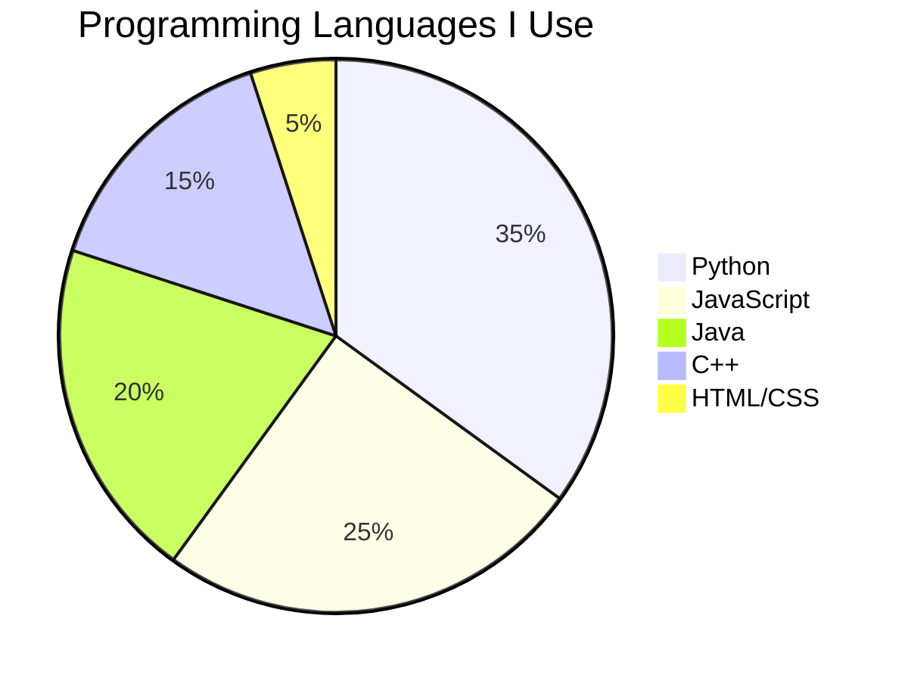

# 👋 Hi there, I'm Ben!

## 🚀 Software Engineering Student at UNSW

I'm passionate about software development and currently studying Computer Science. I love working on projects that challenge me and help me grow as a developer.

### 💻 Languages & Technologies

### 📊 My GitHub Stats

### 🔥 Most Used Languages

### 📈 Language Usage Chart

### 🎯 Current Projects

- **COMP3142 Assignment 1** - Software Testing & Quality Assurance
- **Accelerated C++** - Learning advanced C++ concepts
- **Personal Portfolio** - Building my developer portfolio

### 📚 What I'm Learning

- Software Testing & Quality Assurance
- Advanced C++ Programming
- Web Development
- Data Structures & Algorithms

### 🤝 Let's Connect!

---

⭐ **Fun fact**: I'm currently working on software testing methodologies and learning how to write robust, maintainable code!

*Last updated: June 2024* 